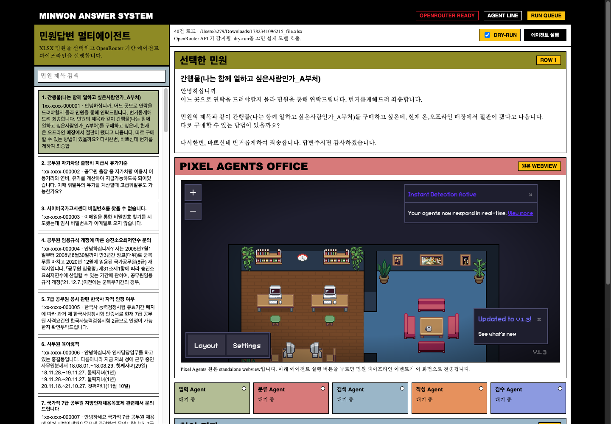

# Minwon OpenRouter Agents

OpenRouter 기반 민원 처리 멀티에이전트 MVP.

목표는 민원 XLSX 입력을 OpenRouter 기반 멀티에이전트로 처리하고,
그 실행 과정을 Pixel Agents 방식의 office 시각화로 보여주는 것이다.



## Submission Notes

이 저장소는 과제 제출용 public GitHub repository로 공유할 수 있는 형태다.
평가자는 GitHub에서 구현 코드를 확인하고, 아래 실행 방법대로 clone 후 로컬에서
동작을 재현할 수 있다.

`http://127.0.0.1:8765/?v=real-pixel` 주소는 로컬 실행 주소이므로, 저장소를
받아 서버를 실행한 사람의 컴퓨터에서만 열린다. 공개 웹 URL까지 필요하면 별도
서버 배포가 필요하다. Render 배포 절차는 `DEPLOY_RENDER.md`에 정리했다.

실제 OpenRouter API key는 public GitHub에 올리지 않는다. `.env.example`만
포함하고, 실제 실행 시 `.env.local`을 만들어 사용한다.

## Pipeline

1. `IntakeAgent`: XLSX에서 민원 1건을 선택한다.
2. `ClassifyAgent`: 민원 유형, 난이도, 민감도, 검색 키워드, 법령 후보를 추출한다.
3. `RetrieveAgent`: 법령/키워드 후보를 바탕으로 근거 후보를 만든다. 현재 MVP는 로컬 규칙 기반이며, 다음 단계에서 법제처 API로 교체한다.
4. `DraftAgent`: 근거 후보를 바탕으로 답변 초안을 작성한다.
5. `ReviewAgent`: 초안을 검수하고 최종 답변을 만든다.

각 단계는 `AgentEvent`를 출력한다. 웹 실행 시
`minwon_agents.pixel_adapter.PixelAgentsAdapter`가 이 이벤트를 Pixel Agents의
`ServerMessage`와 같은 형태인 `agentCreated`, `agentStatus`, `agentToolStart`,
`agentToolDone` 메시지로 변환하고, `PixelAgentsBridge`가 실제 Pixel Agents
standalone 서버로 전송한다.

## Pixel Agents Integration

Pixel Agents가 기본적으로 Claude CLI 중심으로 동작하는 이유는 화면이 Claude에
묶여 있어서가 아니라, bundled server entrypoint가 Claude Code hook 설치와
`.claude` 로그 스캔을 전제로 실행되기 때문이다. 원본 UI는 WebSocket으로
`ServerMessage`를 받아 agent/world 상태를 갱신한다.

이 프로젝트는 Pixel Agents 원본 서버에 다음 보완을 적용해 Claude CLI 없이도
동작하게 한다.

1. `--external-only`: Claude hook 설치와 로그 스캔을 끄고 standalone 서버만 실행한다.
2. `POST /api/external/messages`: 외부 시스템이 Pixel Agents `ServerMessage`를 주입한다.
3. 민원 웹의 `PIXEL AGENTS OFFICE`: 원본 Pixel Agents webview를 iframe으로 표시한다.

민원 파이프라인은 Claude CLI 대신 자체 실행 이벤트를 만들고, 이를 Pixel Agents
메시지로 변환해 `/api/external/messages`로 보낸다.

매핑은 다음과 같다.

1. `stage start` -> `agentStatus(active)` + `agentToolStart`
2. `stage done` -> `agentToolDone` + `agentStatus(waiting)`
3. `pipeline done` -> `agentToolsClear`

웹 화면의 `PIXEL AGENTS OFFICE` 섹션은 민원 웹이 직접 그린 모사 화면이 아니라,
`http://127.0.0.1:3100`에서 실행 중인 Pixel Agents 원본 webview다.

## Run

GitHub 제출 시에는 `.env.local`을 올리지 않는다. 실제 키는 로컬 또는 배포
환경변수에만 넣고, 저장소에는 `.env.example`만 포함한다.

```bash
cp .env.example .env.local
# .env.local 안의 OPENROUTER_API_KEY=sk-or-... 값을 실제 키로 교체
```

Pixel Agents 원본에 OpenRouter/외부 에이전트 이벤트를 연결하려면 이 저장소의
`pixel-agents-openrouter.patch`를 적용한다.

```bash
git clone https://github.com/pixel-agents-hq/pixel-agents.git pixel-agents-minwon
cd pixel-agents-minwon
git apply ../minwon-openrouter-agents/pixel-agents-openrouter.patch
npm install
npm run build
```

Dry run:

```bash
cd minwon-openrouter-agents
python3 -m minwon_agents.run \
  --xlsx data/minwon_sample.xlsx \
  --row 4 \
  --dry-run
```

Pixel Agents server:

```bash
cd pixel-agents-minwon
node dist/cli.js --external-only --host 127.0.0.1 --port 3100
```

Minwon Web UI:

```bash
cd minwon-openrouter-agents
export PIXEL_AGENTS_URL=http://127.0.0.1:3100
python3 -m minwon_agents.web --host 127.0.0.1 --port 8765
```

브라우저에서 `http://127.0.0.1:8765/?v=real-pixel`을 열면 된다.

Real OpenRouter run:

```bash
export OPENROUTER_API_KEY=sk-or-...
python3 -m minwon_agents.run \
  --xlsx data/minwon_sample.xlsx \
  --row 4
```

## Model Settings

환경변수로 단계별 모델을 바꿀 수 있다.

```bash
export OR_CLASSIFY_MODEL=mistralai/mistral-small-3.2-24b-instruct
export OR_DRAFT_MODEL=google/gemini-2.5-flash
export OR_REVIEW_MODEL=google/gemini-2.5-flash-lite
```
